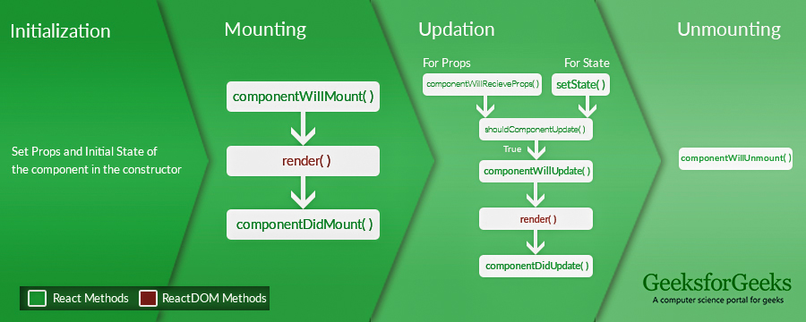

### Component & Props
```jsx
function Welcome(props) {
  return <h1>Hello, {props.name}</h1>;
}

class Welcome extends React.Component {
  render() {
    return <h1>Hello, {this.props.name}</h1>;
  }
}
const element = <Welcome name="Sara" />;
ReactDOM.render(
  element,
  document.getElementById('root')
);
```
### State & LifeCycle


1. ReactDOM.render()

2. Converting a Function to a Class
Create an ES6 class, with the same name, that extends React.Component.
Add a single empty method to it called render().
Move the body of the function into the render() method.
Replace props with this.props in the render() body.

3. Example
```jsx
class Clock extends React.Component {
  constructor(props) {
    super(props);
    this.state = {date: new Date()};
  }
  componentDidMount() {
  //runs after the component output has been rendered to the DOM. This is a //good place to set up a timer:
  }

  componentWillUnmount() {
  //clearInterval(this.timerID);
  }
 fun(){
 //this.setState()
 }

  render() {
    return (
      <div>
        <h1>Hello, world!</h1>
        <h2>It is {this.state.date.toLocaleTimeString()}.</h2>
      </div>
    );
  }
}
```

4.
```jsx
// Wrong
this.state.comment = 'Hello';

Instead, use setState():
// Correct
this.setState({comment: 'Hello'});

//The only place where you can assign this.state is the constructor.
```

5.
```jsx
// Wrong
this.setState({
  counter: this.state.counter + this.props.increment,
});

// Correct
this.setState((state, props) => ({
  counter: state.counter + props.increment
}));
```
### Events
```jsx
class Toggle extends React.Component {
  constructor(props) {
    super(props);
    this.state = {isToggleOn: true,value:'" "};

    // This binding is necessary to make `this` work in the callback
    this.handleClick = this.handleClick.bind(this);
  }

  handleClick() {
    this.setState(state => ({
      isToggleOn: !state.isToggleOn
    }));
  }
  handleChange(event) {
    this.setState({value: event.target.value});
  }

  handleSubmit(event) {
    alert('An essay was submitted: ' + this.state.value);
    event.preventDefault();
  }

  render() {
    return (
      <button onClick={this.handleClick}>
        {this.state.isToggleOn ? 'ON' : 'OFF'}
      </button>
      <textarea value={this.state.value} onChange={this.handleChange} />
    );
  }
}
```

### JSX
syntax extension to JavaScript

1. Specifying Attributes with JSX
```jsx
</img>;
```

2. Embedding Expressions in JSX
```jsx
<h1>Hello, {name}</h1>;
```

3. JSX Prevents Injection Attacks
```jsx
const title = response.potentiallyMaliciousInput;
// This is safe:
const element = <h1>{title}</h1>;
```
It ensures that you can never inject anything that’s not explicitly written in your application. Everything is converted to a string before being rendered. This helps prevent XSS (cross-site-scripting) attacks.


### Virtual DOM
The virtual DOM (VDOM) is a programming concept where “virtual”, representation of a UI is kept in memory and synced with the “real” DOM by a library such as ReactDOM.

What is “React Fiber”?
Fiber is the new reconciliation engine in React 16. Its main goal is to enable incremental rendering of the virtual DOM

SPAs (Single Page Applications) — no page reloads, no extra wait time. It is just one web page that you visit which then loads different components.

### Redux
component -> action ->dispatches -> reduces 
