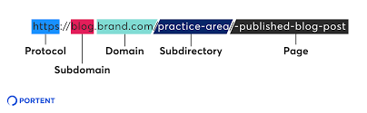

1. Cross-Origin Resource Sharing **(CORS)**

Cross-origin resource sharing (CORS) is a mechanism that allows restricted resources on a web page to be requested from **another domain** outside the domain from which the first resource was served. A web page may freely embed cross-origin images, stylesheets, scripts, iframes, and videos.

2. 
local storage
session storage 
LocalStorage and SessionStorage can use up to 10MB of storage 

Cookies are mainly for reading server-side, whereas local storage can only be read by the client-side. 
Cookies can be accessed either by the web server or the client computer. 
the data can be retrieved and used to customize the web page appropriately. 
cookies are usually limited to 4096 bytes and you can't store more than 20 cookies per site.  

3. Domain

3. What are the advantages of HTTP 2.0 over HTTP 1.1? 
The major advantages are: headers compression, push notification, intelligent packet streaming management and parallel loading of page elements over a single TCP connection.

4. SEO - robots.txt, manifest.json, sitemap.xml,  keywords, page loading time
